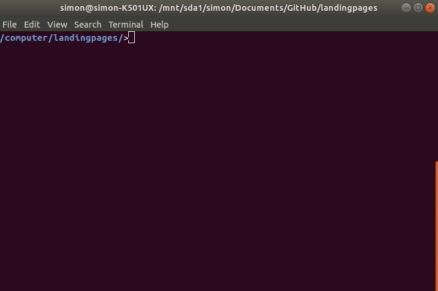

# Neotoma Paleoecology Database Landing Pages

This project is used to develop a Javascript `Vue.js` application to serve [Neotoma Paleoecology Database](http://neotomadb.org/) datasets as landing pages.

The page leverages the [Neotoma v2 API](http://github.com/NeotomaDB/api_nodetest) and existing database structure to provide a consistently styled landing page for all Neotoma Datasets.

## Contributors

*   [Simon Goring](http://goring.org)
*   Michael Stryker
*   [The Neotoma Paleoecology Database](http://neotomadb.org)

## Deploying the App

### Packages

This application is built using a number of JavaScript packages:

*   [`node.js`](https://nodejs.org/en/)
*   [`express.js`](https://expressjs.com/) to manage server-side applications
*   [`Vue.js`](https://vuejs.org/) to develop the page templates and responsive behavior
*   [`vue-router`](https://router.vuejs.org/) to manage paths within the singe-page application
*   [`leaflet.js`](https://leafletjs.com/) to render maps and provide map functionality

To initialize the package locally using the GitHub repository the user is expected to clone or download the repository from GitHub.  Once the files have been transferred to the user's computer run `npm install`.  This will ensure all packages are transferred properly.

#### Updating and Managing Packages

The developers of this repository will make an effort to manage packages effectively, however the user may wish to update packages, or check to ensure [node package security](https://docs.npmjs.com/auditing-package-dependencies-for-security-vulnerabilities) is appropriately managed.

*   To update package: `npm update`
*   To audit for package security: `npm audit`(`npm audit fix` will audit and automatically update packages with security vulnerabilities)
*   To manage updates without version policing (which may lead to audit issues) the user may consider the use of the package [`npm-check-updates`](https://www.npmjs.com/package/npm-check-updates).

### Development

During development the various [Vue.js components](https://vuejs.org/v2/guide/components.html) are edited and the development version can be run directly from terminal using the command:

```
npm run serve
```



This command will build the site and render it, serving it through `localhost:8080` (this is the address you would direct your browser to if you wanted to see the page).  The `npm` script watches the local directories for the project and will auto-update the application when files are changed.  Using this script allows you to modify the site directly on your computer, and see changes (almost) immediately through your browser.  It also provides you with the opportunity to use tools like the [FireFox Developer Tools](https://developer.mozilla.org/son/docs/Tools), to help see how your changes might affect the visual display of your application.

### Production

For the Vue app to be run on a production server (for example, the [http://data-dev.neotomadb.org]() server) the Vue app must first be converted into an HTML document.  To do this you can run:

```
npm run build
```

This then generates a directory (in `dist`) that can support a static deployment of the website built with Vue.  The directory, `dist/`, contains an `index.html` file that will be used on the server when individuals direct their browser to the proper host (in this case `data-dev.neotomadb.org`).  To help serve the document a `server.js` file is used to listen on the server.

To use this as a working website you can then link the root directory on the server to this GitHub repository.  Pull the repository with `git pull`, and then build using `npm run build`.  Neotoma uses [`pm2`](http://pm2.keymetrics.io/) to watch and restart the application on the server.  With this workflow (`git` -> `pm2`) it is possible to generate and update the site rapidly in response to user needs.

## Funding Support

This work is funded in part by grants from the National Science Foundation 1541002, 1550855 and 1550707.
